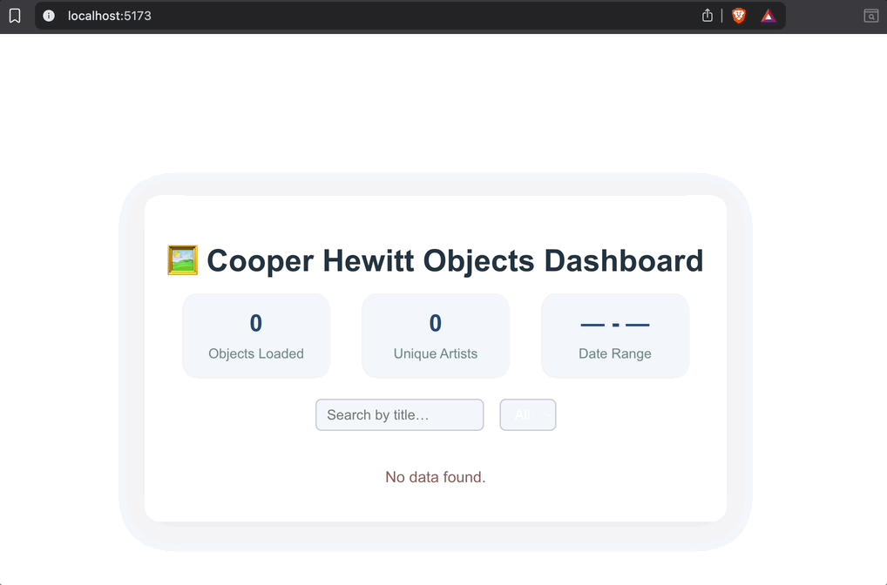

# Web Development Project 5 - Cooper Hewitt Objects Dashboard

Submitted by: **Md Rakibul Hasan**

This web app: **provides an interactive dashboard that showcases objects from the Cooper Hewitt Smithsonian Design Museum’s collection. It fetches data using the museum’s public API and displays a searchable, filterable list of artworks along with summary statistics to help users explore and discover interesting patterns within the collection.**

Time spent: **4** hours spent in total

## Required Features

The following **required** functionality is completed:

- [x] **The site has a dashboard displaying a list of data fetched using an API call**
  - The dashboard displays at least 10 unique objects, one per row
  - Each row includes at least two features (title, artist, date, and type)
- [x] **`useEffect` React hook and `async`/`await` are used**
- [x] **The app dashboard includes at least three summary statistics about the data** 
  - The dashboard shows:
    - **Total number of objects loaded**
    - **Number of unique artists represented**
    - **Earliest and latest date in the displayed collection**
- [x] **A search bar allows the user to search for an item in the fetched data**
  - The search bar correctly filters items by their title, updating results as the user types
- [x] **An additional filter allows the user to restrict displayed items by specified categories**
  - The filter restricts items by object type (e.g., Drawing, Print, Textile)
  - The dashboard updates dynamically as the user changes the filter

The following **optional** features are implemented:

- [ ] Multiple filters can be applied simultaneously
- [x] Filters use different input types (search text input for title, dropdown select for type)
- [ ] The user can enter specific bounds for filter values

The following **additional** features are implemented:

* [ ] The app displays a friendly loading state and error messages if the API call fails
* [ ] Responsive and modern design for easy viewing on different screen sizes

## Video Walkthrough

Here's a walkthrough of implemented user stories:

## Notes

Describe any challenges encountered while building the app.

- Working with the Cooper Hewitt API required obtaining an access token and understanding the object schema, as some fields (like artist) were occasionally missing.
- Formatting dates and handling missing data gracefully required careful mapping and error handling.
- Making the dashboard visually appealing while keeping it clear and easy to use involved custom CSS and testing on various screen sizes.

## License

Copyright 2024 [Md Rakibul Hasan]

Licensed under the Apache License, Version 2.0 (the "License");
you may not use this file except in compliance with the License.
You may obtain a copy of the License at

    http://www.apache.org/licenses/LICENSE-2.0

Unless required by applicable law or agreed to in writing, software
distributed under the License is distributed on an "AS IS" BASIS,
WITHOUT WARRANTIES OR CONDITIONS OF ANY KIND, either express or implied.
See the License for the specific language governing permissions and
limitations under the License.
